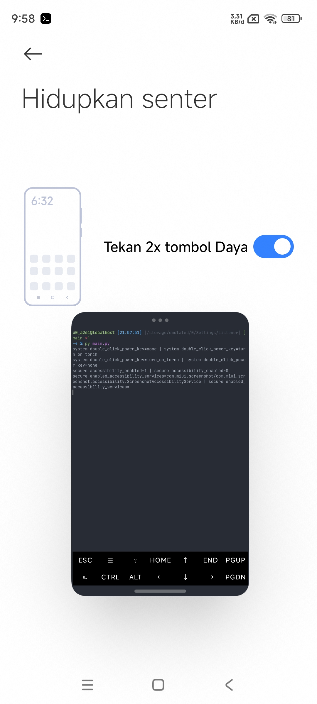

# SetListenner
Adalah script untuk melihat perubahan nilai pada package com.android.setting, tujuan script ini dibuat untuk melacak kategori, keys dan value yang diterapkan, dan kemudian dapat digunakan untuk pengesetan nilai pada CLI "cmd settings" | "settings" pada Android.

## Penggunaan
Cukup jalankan script ini dalam mode root dan minimize jendela terminal anda lalu pergi ke settingan android, lalu ubah settinggan apapun didalam android anda sambil melihat perubahan pada result jendal terminal.




# CLI Settings Android

CLI ```cmd settings``` | ```settings``` adalah CLI untuk mengkonfigurasi pengaturan di dalam Android.

## Manfaat

- **Otomatisasi Pengaturan:** Anda dapat membuat script otomatis untuk menyetel pengaturan yang sudah diketahui keys dan nilainya, kemudian menerapkannya ke ROM lain (ROM baru).
- **Backup dan Restore:** Anda dapat membackup konfigurasi file yang telah diatur dan menerapkannya ke ROM lain.

## Cara Menggunakan

CLI "settings" atau "cmd settings" terbagi menjadi 3 kategori:

1. **system**
2. **global**
3. **secure**

#### Melihat Variabel dan Nilai

Untuk melihat variabel dan nilai yang tertera, gunakan perintah `settings list <Kategori>`.

Contoh:
```
settings list system 
```
Untuk melihat konfigurasi variabel dan nilai yang ada pada pengaturan `system`.

#### Menghapus/Menonaktifkan

Gunakan perintah `settings delete <kategori> <kata_kunci>`.

Contoh:
```
settings delete system double_click_power_key
```
Untuk mematikan fitur Flashlight dengan menekan tombol power 2x.

#### Memasukkan Nilai/Mengaktifkan

Gunakan perintah `settings put <kategori> <kata_kunci> <nilai>`.

Contoh:
```
settings put system double_click_power_key turn_on_torch
```
Untuk mengaktifkan fitur Flashlight dengan menekan tombol power 2x.

## Contoh Pengaturan

Berikut ini adalah beberapa contoh kategori, value dan nilai pengaturan:

1. #### Mengaktifkan opsi developer
   global development_settings_enabled 1

2. #### Mengatur skala animasi
   global animator_duration_scale 0.5

3. #### Memaksakan aktivitas agar dapat diubah ukurannya
   global force_resizable_activities 1

4. #### Mengaktifkan dukungan Freeform
   global enable_freeform_support 1

5. #### Menutup aplikasi dengan menekan tombol kembali lama
   system long_press_back_key close_app

6. #### Mengaktifkan senter dengan mengklik dua kali tombol power
   system double_click_power_key turn_on_torch

7. #### Mengaktifkan senter dengan menekan tombol home lama
   system long_press_home_key turn_on_torch

8. #### Mengatur ukuran grid layar home
   system miui_home_screen_cells_size 5x9

9. #### Menonaktifkan tindakan geser ke atas pada launcher
   system system com.miui.home.preferences.launcher_slideup_gesture no_action

10. #### Mengatur tindakan geser ke bawah pada launcher
   system com.miui.home.preferences.launcher_pulldown_gesture=notification_bar

11. #### Menampilkan informasi memori pada layar Recent Apps
   system miui_recents_show_mem_info 1

12. #### Menampilkan kecepatan jaringan pada status bar
   system status_bar_show_network_speed 1

13. #### Mengaktifkan asisten pribadi
   system open_personal_assistant 1

14. #### Mengatur mode navigasi 
   secure navigation_mode 0

15. #### Mengaktifkan balasan cepat 
   secure quick_reply_enable 1

16. #### Memaksakan penggunaan gesture navigation bar
   global force_fsg_nav_bar 0 

### Lokasi File Konfigurasi

1. **System:** `/data/system/users/0/settings_system.xml`
2. **Global:** `/data/system/users/0/settings_global.xml`
3. **Secure:** `/data/system/users/0/settings_secure.xml`

### Informasi Tambahan

* **Pengujian:** Redmi note 9 pro Android 14 HyperOs.
* **Akses:** Dibutuhkan akses root.
* **Penerapan** https://youtu.be/IwVXcVr1VXY?si=JJGT0HNFidr2stQI

**Catatan:**

- Gunakan perintah `settings help` untuk mendapatkan bantuan tentang CLI settings.
- Cari `kata_kunci` dan `nilai` yang Anda perlukan di dalam file konfigurasi.
- Berhati-hatilah saat mengubah pengaturan, karena bisa menyebabkan masalah pada sistem.
- Selalu buat backup sebelum melakukan perubahan besar.

Semoga ini membantu Anda!
